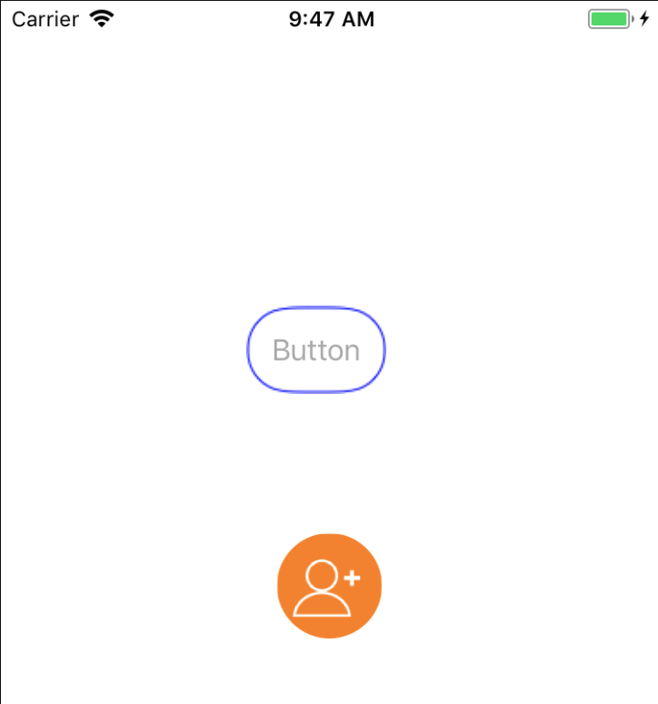
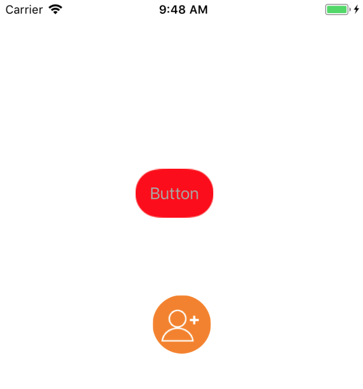

# 代替会导致离屏渲染的 cornerRadius 圆角解决方案

在对按钮或 imageview 等进行圆角处理时，我们常常会使用到 layer.cornerRadius 属性，同时设置 layer.masksToBounds 为 YES。 其实 cornerRadius 并不会导致离屏渲染，而是 masksToBounds 导致了离屏渲染。

这个 demo 对 UIView 进行了扩展，用 Core Image 来绘制圆角图片，以取代 cornerRadius 和 masksToBounds 属性，从而避免了离屏渲染。

demo 的效果如下：

